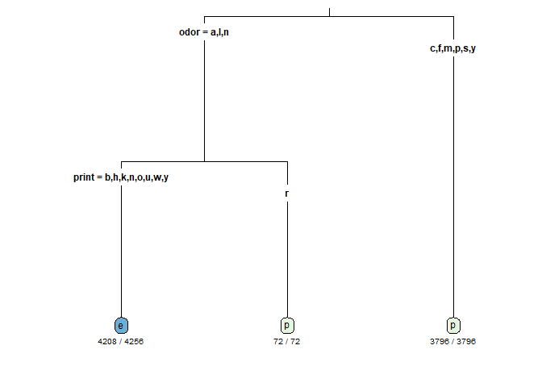

decision trees in R
================
chad allison \| 9 december 2022

### loading libraries

``` r
library(tidyverse)
library(rpart)
library(rpart.plot)
```

### loading the data

``` r
# download.file("https://ibm.box.com/shared/static/dpdh09s70abyiwxguehqvcq3dn0m7wve.data", "mushroom.data")
df = read.csv("mushroom.data", header = F)
head(df[1:8])
```

    ##   V1 V2 V3 V4 V5 V6 V7 V8
    ## 1  p  x  s  n  t  p  f  c
    ## 2  e  x  s  y  t  a  f  c
    ## 3  e  b  s  w  t  l  f  c
    ## 4  p  x  y  w  t  p  f  c
    ## 5  e  x  s  g  f  n  f  w
    ## 6  e  x  y  y  t  a  f  c

### defining column names

``` r
colnames(df) = c("Class", "cap.shape", "cap.surface", "cap.color", "bruises", "odor",
                 "gill.attachment", "gill.spacing", "gill.size", "gill.color", "stalk.shape",
                 "stalk.root", "stalk.surface.above.ring", "stalk.surface.below.ring",
                 "stalk.color.above.ring", "stalk.color.below.ring", "veil.type", "veil.color",
                 "ring.number","ring.type","print","population","habitat")

head(df[1:8])
```

    ##   Class cap.shape cap.surface cap.color bruises odor gill.attachment
    ## 1     p         x           s         n       t    p               f
    ## 2     e         x           s         y       t    a               f
    ## 3     e         b           s         w       t    l               f
    ## 4     p         x           y         w       t    p               f
    ## 5     e         x           s         g       f    n               f
    ## 6     e         x           y         y       t    a               f
    ##   gill.spacing
    ## 1            c
    ## 2            c
    ## 3            c
    ## 4            c
    ## 5            w
    ## 6            c

### defining factor levels for `Class`, `odor`, and `print`

``` r
levels(df$Class) = c("Edible", "Poisonous")
levels(df$odor) = c("Almonds", "Anise", "Creosote", "Fishy", "Foul", "Musty", "None", "Pungent", "Spicy")
levels(df$print) = c("Black", "Brown", "Buff", "Chocolate", "Green", "Orange", "Purple", "White", "Yellow")
head(df[1:8])
```

    ##   Class cap.shape cap.surface cap.color bruises odor gill.attachment
    ## 1     p         x           s         n       t    p               f
    ## 2     e         x           s         y       t    a               f
    ## 3     e         b           s         w       t    l               f
    ## 4     p         x           y         w       t    p               f
    ## 5     e         x           s         g       f    n               f
    ## 6     e         x           y         y       t    a               f
    ##   gill.spacing
    ## 1            c
    ## 2            c
    ## 3            c
    ## 4            c
    ## 5            w
    ## 6            c

### creating the decision tree

``` r
decision_tree = rpart(Class ~ ., data = df, method = "class")
print(decision_tree)
```

    ## n= 8124 
    ## 
    ## node), split, n, loss, yval, (yprob)
    ##       * denotes terminal node
    ## 
    ## 1) root 8124 3916 e (0.51797144 0.48202856)  
    ##   2) odor=a,l,n 4328  120 e (0.97227357 0.02772643)  
    ##     4) print=b,h,k,n,o,u,w,y 4256   48 e (0.98872180 0.01127820) *
    ##     5) print=r 72    0 p (0.00000000 1.00000000) *
    ##   3) odor=c,f,m,p,s,y 3796    0 p (0.00000000 1.00000000) *

### visualising the decision tree

``` r
rpart.plot(decision_tree, type = 3, extra = 2, under = T, faclen = 5, cex = 0.75)
```

<!-- -->

### making a prediction

``` r
newCase = df[10, -1]
predict(decision_tree, newCase, type = "class") # correct prediction
```

    ## 10 
    ##  e 
    ## Levels: e p

### how accurate is the model? splitting the data

``` r
n = nrow(df)
sample_size = floor(0.75 * n)
set.seed(123)
train_ind = sample(c(1:n), size = sample_size)
df_train = df[train_ind, ]
df_test = df[-train_ind, ]

head(df_train[1:8])
```

    ##      Class cap.shape cap.surface cap.color bruises odor gill.attachment
    ## 2463     e         x           y         g       t    n               f
    ## 2511     e         f           f         e       t    n               f
    ## 2227     e         x           f         e       t    n               f
    ## 526      e         b           s         y       t    l               f
    ## 4291     p         f           y         g       f    f               f
    ## 2986     e         f           y         g       t    n               f
    ##      gill.spacing
    ## 2463            c
    ## 2511            c
    ## 2227            c
    ## 526             c
    ## 4291            c
    ## 2986            c

### training a new decision tree

``` r
new_tree = rpart(Class ~ ., data = df_train, method = "class")
result = predict(new_tree, df_test[, -1], type = "class")
conf_mat = table(df_test$Class, result)
conf_mat
```

    ##    result
    ##        e    p
    ##   e 1068    0
    ##   p   15  948

``` r
acc = round(sum(diag(conf_mat)) / sum(conf_mat), 4)
paste("model accuracy:", acc)
```

    ## [1] "model accuracy: 0.9926"
