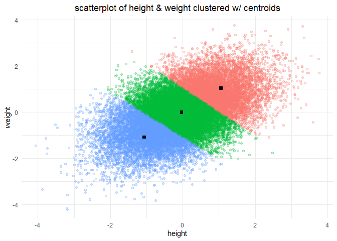

k means clustering
================
chad allison
2023-01-26

### setup

``` r
library(tidyverse)
theme_set(theme_minimal())
```

### data import

``` r
df = read.csv("hk_kids.csv", sep = ";")
glimpse(df)
```

    ## Rows: 25,000
    ## Columns: 3
    ## $ Index          <int> 1, 2, 3, 4, 5, 6, 7, 8, 9, 10, 11, 12, 13, 14, 15, 16, ~
    ## $ Height.Inches. <dbl> 65.78331, 71.51521, 69.39874, 68.21660, 67.78781, 68.69~
    ## $ Weight.Pounds. <dbl> 112.99250, 136.48730, 153.02690, 142.33540, 144.29710, ~

### changing column names

``` r
colnames(df) = c("index", "height", "weight")
glimpse(df)
```

    ## Rows: 25,000
    ## Columns: 3
    ## $ index  <int> 1, 2, 3, 4, 5, 6, 7, 8, 9, 10, 11, 12, 13, 14, 15, 16, 17, 18, ~
    ## $ height <dbl> 65.78331, 71.51521, 69.39874, 68.21660, 67.78781, 68.69784, 69.~
    ## $ weight <dbl> 112.99250, 136.48730, 153.02690, 142.33540, 144.29710, 123.3024~

### removing `index` column

``` r
df = select(df, -index)
glimpse(df)
```

    ## Rows: 25,000
    ## Columns: 2
    ## $ height <dbl> 65.78331, 71.51521, 69.39874, 68.21660, 67.78781, 68.69784, 69.~
    ## $ weight <dbl> 112.99250, 136.48730, 153.02690, 142.33540, 144.29710, 123.3024~

### visualizing data

``` r
df |>
  ggplot(aes(height, weight)) +
  geom_point(size = 2, alpha = 0.5) +
  geom_point(size = 0.1, col = "springgreen4", alpha = 0.25) +
  labs(x = "height (inches)", y = "weight (lbs)", title = "scatterplot of height and weight") +
  theme(plot.title = element_text(hjust = 0.5))
```

<!-- -->

### normalizing data

``` r
height_mean = mean(df$height)
height_sd = sd(df$height)
weight_mean = mean(df$weight)
weight_sd = sd(df$weight)

df = df |>
  mutate(height = round((height - height_mean) / height_sd, 4),
         weight = round((weight - weight_mean) / weight_sd, 4))

df |>
  pivot_longer(everything()) |>
  ggplot(aes(name, value)) +
  geom_boxplot(aes(fill = name)) +
  scale_fill_manual(values = c("#92C191", "#BA98CA")) +
  labs(x = "metric", y = "value", title = "distribution of normalized height & weight") +
  theme(plot.title = element_text(hjust = 0.5),
        legend.position = "none")
```

<!-- -->

### building clusters

``` r
clusters_numbers = kmeans(df, centers = 3, iter.max = 10)
clusters_numbers[2]
```

    ## $centers
    ##        height       weight
    ## 1  1.05993226  1.038399351
    ## 2 -0.02828897 -0.006523548
    ## 3 -1.06505421 -1.080266252

### visualising height and weight post-clustering

``` r
df$cluster = as.factor(clusters_numbers$cluster)

df |>
  ggplot(aes(height, weight)) +
  geom_point(size = 2, alpha = 0.25) +
  geom_point(aes(col = cluster), size = 0.1, alpha = 0.5) +
  labs(x = "height (inches)", y = "weight (lbs)", title = "scatterplot of clustered height and weight") +
  theme(plot.title = element_text(hjust = 0.5),
        legend.position = "none")
```

<!-- -->

### getting cluster centroid locations

``` r
centroids = data.frame(clusters_numbers$centers)
centroids
```

    ##        height       weight
    ## 1  1.05993226  1.038399351
    ## 2 -0.02828897 -0.006523548
    ## 3 -1.06505421 -1.080266252

### re-plotting with centroids

``` r
df |>
  ggplot(aes(height, weight)) +
  geom_point(aes(col = cluster), alpha = 0.25) +
  annotate("point", x = centroids$height[1], y = centroids$weight[1], shape = "square", size = 2) +
  annotate("point", x = centroids$height[2], y = centroids$weight[2], shape = "square", size = 2) +
  annotate("point", x = centroids$height[3], y = centroids$weight[3], shape = "square", size = 2) +
  labs(title = "scatterplot of height & weight clustered w/ centroids") +
  theme(plot.title = element_text(hjust = 0.5),
        legend.position = "none")
```

<!-- -->

### getting t-shirt sizes

``` r
tee_sizes = centroids
tee_sizes$height = round((tee_sizes$height * height_sd) + height_mean, 2)
tee_sizes$weight = round((tee_sizes$weight * weight_sd) + weight_mean, 2)

tee_sizes = tee_sizes |>
  arrange(height) |>
  mutate(size = c("small", "medium", "large"))

rownames(tee_sizes) = NULL
tee_sizes
```

    ##   height weight   size
    ## 1  65.97 114.48  small
    ## 2  67.94 127.00 medium
    ## 3  70.01 139.19  large

### getting standard deviations for each size

``` r
df |>
  mutate(height = height * height_sd + height_mean,
         weight = weight * weight_sd + weight_mean) |>
  group_by(cluster) |>
  summarise(mh = mean(height), sh = sd(height),
            mw = mean(weight), sw = sd(weight)) |>
  arrange(mh) |>
  transmute(cluster = c("small", "medium", "large"),
            height_sd = sh, weight_sd = sw)
```

    ## # A tibble: 3 x 3
    ##   cluster height_sd weight_sd
    ##   <chr>       <dbl>     <dbl>
    ## 1 small        1.27      7.79
    ## 2 medium       1.10      6.73
    ## 3 large        1.23      7.76
