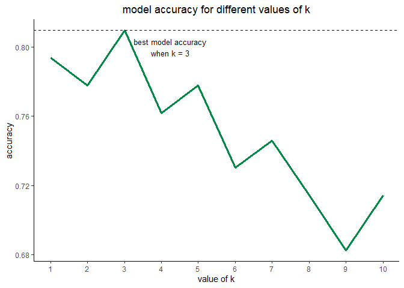

k-nearest neighbors in R
================
chad allison \| 8 december 2022

### loading required libraries

``` r
library(class)
library(caret)
library(mlbench)
library(e1071)
library(tidyverse)
```

### data collection

``` r
data(Sonar)
df = Sonar
head(df[1:10])
```

    ##       V1     V2     V3     V4     V5     V6     V7     V8     V9    V10
    ## 1 0.0200 0.0371 0.0428 0.0207 0.0954 0.0986 0.1539 0.1601 0.3109 0.2111
    ## 2 0.0453 0.0523 0.0843 0.0689 0.1183 0.2583 0.2156 0.3481 0.3337 0.2872
    ## 3 0.0262 0.0582 0.1099 0.1083 0.0974 0.2280 0.2431 0.3771 0.5598 0.6194
    ## 4 0.0100 0.0171 0.0623 0.0205 0.0205 0.0368 0.1098 0.1276 0.0598 0.1264
    ## 5 0.0762 0.0666 0.0481 0.0394 0.0590 0.0649 0.1209 0.2467 0.3564 0.4459
    ## 6 0.0286 0.0453 0.0277 0.0174 0.0384 0.0990 0.1201 0.1833 0.2105 0.3039

### preparing and exploring the data

``` r
paste0("the data has ", nrow(df), " rows and ", ncol(df), " columns")
```

    ## [1] "the data has 208 rows and 61 columns"

### checking how many `M` and `R` classes in the data and seeing if we have `NA` values

``` r
table(df$Class)
```

    ## 
    ##   M   R 
    ## 111  97

``` r
colSums(is.na(df))
```

    ##    V1    V2    V3    V4    V5    V6    V7    V8    V9   V10   V11   V12   V13 
    ##     0     0     0     0     0     0     0     0     0     0     0     0     0 
    ##   V14   V15   V16   V17   V18   V19   V20   V21   V22   V23   V24   V25   V26 
    ##     0     0     0     0     0     0     0     0     0     0     0     0     0 
    ##   V27   V28   V29   V30   V31   V32   V33   V34   V35   V36   V37   V38   V39 
    ##     0     0     0     0     0     0     0     0     0     0     0     0     0 
    ##   V40   V41   V42   V43   V44   V45   V46   V47   V48   V49   V50   V51   V52 
    ##     0     0     0     0     0     0     0     0     0     0     0     0     0 
    ##   V53   V54   V55   V56   V57   V58   V59   V60 Class 
    ##     0     0     0     0     0     0     0     0     0

### splitting data into training and testing sets

``` r
set.seed(123)
df = df[sample(nrow(df)), ] # shuffling the data
bound = floor(0.7 * nrow(df))
df_train = df[1:bound, ]
df_test = df[(bound + 1):nrow(df), ]

paste0("the data has ", nrow(df_train), " observations in the training set and ", nrow(df_test),
       " observations in the testing set")
```

    ## [1] "the data has 145 observations in the training set and 63 observations in the testing set"

### checking distribution of `Class` labels in training and testing data

``` r
cat("class distribution in training data: \n", round(table(df_train$Class) / nrow(df_train), 3))
```

    ## class distribution in training data: 
    ##  0.517 0.483

``` r
cat("class distribution in testing data: \n", round(table(df_test$Class)/nrow(df_test), 3))
```

    ## class distribution in testing data: 
    ##  0.571 0.429

### creating data frames for predictors and outcomes

``` r
x_train = subset(df_train, select = -Class)
y_train = df_train$Class
x_test = subset(df_test, select = -Class)
y_test = df_test$Class

head(x_train[1:5])
```

    ##         V1     V2     V3     V4     V5
    ## 159 0.0107 0.0453 0.0289 0.0713 0.1075
    ## 207 0.0303 0.0353 0.0490 0.0608 0.0167
    ## 179 0.0197 0.0394 0.0384 0.0076 0.0251
    ## 14  0.0090 0.0062 0.0253 0.0489 0.1197
    ## 195 0.0392 0.0108 0.0267 0.0257 0.0410
    ## 170 0.0130 0.0120 0.0436 0.0624 0.0428

``` r
y_train[1:25]
```

    ##  [1] M M M R M M R M R M M M R R M M R M M R R R M M M
    ## Levels: M R

### training the model

``` r
model_knn = knn(train = x_train,
                test = x_test,
                cl = y_train,
                k = 3)

model_knn
```

    ##  [1] M R M M M M M R M R M R M M M M M R R M M R M R M R M R M M R M R M R M M R
    ## [39] M M R M M R M M M M M R M M R R M R R R M R R M R
    ## Levels: M R

### confusion matrix of model performance

``` r
conf_mat = table(y_test, model_knn)
conf_mat
```

    ##       model_knn
    ## y_test  M  R
    ##      M 31  5
    ##      R  7 20

### accuracy of model performance

``` r
round(sum(diag(conf_mat)) / sum(conf_mat), 4)
```

    ## [1] 0.8095

### experimenting with different values of `k`

``` r
set.seed(123)

res = data.frame(i = 1:10, accuracy = NA)

for (i in 1:10) {
  mod = knn(train = x_train,
                  test = x_test,
                  cl = y_train,
                  k = i)

  acc = round(sum(mod == y_test) / length(y_test), 4)
  res$accuracy[i] = acc
}

res |>
  ggplot(aes(i, accuracy, group = 1)) +
  geom_line(col = "springgreen4", linewidth = 1.25) +
  geom_hline(yintercept = max(res$accuracy), linetype = "dashed") +
  annotate("text", x = 4.25, y = 0.8, label = "best model accuracy\nwhen k = 3", size = 3.5) +
  theme_classic() +
  labs(x = "value of k", title = "model accuracy for different values of k") +
  theme(plot.title = element_text(hjust = 0.5)) +
  scale_x_continuous(breaks = 1:10)
```

<!-- -->

### cross validation

``` r
knn_cv = knn.cv(train = x_train, cl = y_train, k = 3)
knn_cv
```

    ##   [1] R M M R M M R M R M M R R R M M M M R R R R M M M R M M M M R M R M M M M
    ##  [38] R R M R M M M M R M R R M R M M R M R M R R M M M R R M M M M R M R M R R
    ##  [75] R R M M R M M M R M M M R R R M M R R R M R M M M M R M M R R M M R M R M
    ## [112] M M R R R M M M M M M R R R R M M R R R R M M M M M R M R M R M R R
    ## Levels: M R

### cross validation confusion matrix

``` r
conf_mat_cv = table(y_train, knn_cv)
conf_mat_cv
```

    ##        knn_cv
    ## y_train  M  R
    ##       M 64 11
    ##       R 18 52

``` r
paste("cross validation accuracy:", sum(diag(conf_mat_cv)) / sum(conf_mat_cv))
```

    ## [1] "cross validation accuracy: 0.8"

### improving the performance of the model

``` r
set.seed(2016)
in_train = createDataPartition(df$Class, p = 0.7, list = F)
ndf_train = df[in_train, ]
ndf_test = df[-in_train, ]

head(ndf_train[1:10])
```

    ##         V1     V2     V3     V4     V5     V6     V7     V8     V9    V10
    ## 159 0.0107 0.0453 0.0289 0.0713 0.1075 0.1019 0.1606 0.2119 0.3061 0.2936
    ## 207 0.0303 0.0353 0.0490 0.0608 0.0167 0.1354 0.1465 0.1123 0.1945 0.2354
    ## 179 0.0197 0.0394 0.0384 0.0076 0.0251 0.0629 0.0747 0.0578 0.1357 0.1695
    ## 14  0.0090 0.0062 0.0253 0.0489 0.1197 0.1589 0.1392 0.0987 0.0955 0.1895
    ## 195 0.0392 0.0108 0.0267 0.0257 0.0410 0.0491 0.1053 0.1690 0.2105 0.2471
    ## 170 0.0130 0.0120 0.0436 0.0624 0.0428 0.0349 0.0384 0.0446 0.1318 0.1375

### specifying cross-validation method

``` r
ctrl = trainControl(method = "repeatedcv", number = 5, repeats = 2)
nn_grid = expand.grid(k = c(1, 3, 5, 7))
nn_grid
```

    ##   k
    ## 1 1
    ## 2 3
    ## 3 5
    ## 4 7

### experimenting with the different `k` values

``` r
set.seed(2016)

best_knn = train(Class ~ ., data = ndf_train,
                 method = "knn", trControl = ctrl,
                 preProcess = c("center", "scale"),
                 tuneGrid = nn_grid)

best_knn
```

    ## k-Nearest Neighbors 
    ## 
    ## 146 samples
    ##  60 predictor
    ##   2 classes: 'M', 'R' 
    ## 
    ## Pre-processing: centered (60), scaled (60) 
    ## Resampling: Cross-Validated (5 fold, repeated 2 times) 
    ## Summary of sample sizes: 117, 116, 116, 117, 118, 117, ... 
    ## Resampling results across tuning parameters:
    ## 
    ##   k  Accuracy   Kappa    
    ##   1  0.8397044  0.6746715
    ##   3  0.8185386  0.6321036
    ##   5  0.7953202  0.5853147
    ##   7  0.7684236  0.5300614
    ## 
    ## Accuracy was used to select the optimal model using the largest value.
    ## The final value used for the model was k = 1.

according to this, `k` = 1 has the highest model accuracy from repeated
cross-validation.
