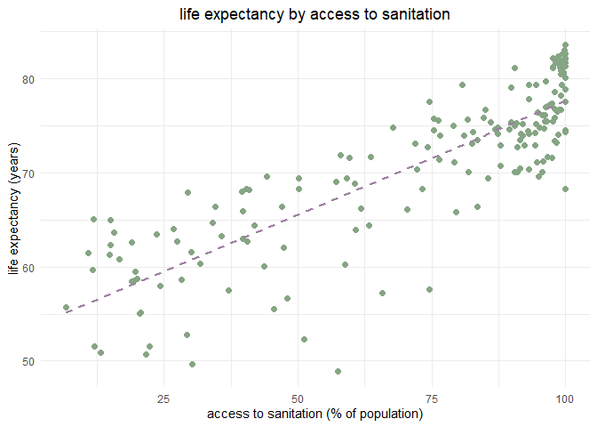

linear regression
================
chad allison
2023-01-23

### setup

``` r
library(tidyverse)
theme_set(theme_minimal())
```

### data import

``` r
my_data = read.csv("https://ibm.box.com/shared/static/q0gt7rsj6z5p3fld163n70i65id3awz3.csv")
glimpse(my_data)
```

    ## Rows: 183
    ## Columns: 3
    ## $ Country              <chr> "Afghanistan", "Albania", "Algeria", "Angola", "A~
    ## $ Access_to_Sanitation <dbl> 31.8, 93.2, 87.4, 51.1, 96.1, 89.5, 97.7, 100.0, ~
    ## $ Life_Expectancy      <dbl> 60.37446, 77.83046, 74.80810, 52.26688, 76.15861,~

### visualizing data

``` r
my_data |>
  ggplot(aes(Access_to_Sanitation, Life_Expectancy)) +
  geom_point(col = "#86A584", size = 2) +
  geom_smooth(formula = y ~ x, se = F, method = "lm", col = "#9E82A2", linetype = "dashed") +
  labs(x = "access to sanitation (% of population)",
       y = "life expectancy (years)",
       title = "life expectancy by access to sanitation") +
  theme(legend.position = "none",
        plot.title = element_text(hjust = 0.5))
```

<!-- -->

### countries with least access to sanitation

``` r
my_data |>
  arrange(Access_to_Sanitation) |>
  head(20) |>
  ggplot(aes(fct_reorder(Country, -Access_to_Sanitation), Access_to_Sanitation)) +
  geom_col(fill = "indianred3", alpha = 0.75) +
  geom_text(aes(label = Access_to_Sanitation), hjust = -0.5, vjust = 0.35, size = 3) +
  coord_flip(ylim = c(0, 25)) +
  labs(x = NULL, y = "access to sanitation (% of population)",
       title = "countries with least access to sanitation") +
  theme(plot.title = element_text(hjust = 0.5))
```

<!-- -->

### countries with lowest life expectancy

``` r
my_data |>
  arrange(Life_Expectancy) |>
  head(20) |>
  ggplot(aes(fct_reorder(Country, -Life_Expectancy), Life_Expectancy)) +
  geom_col(fill = "#779CAE", alpha = 0.75) +
  geom_text(aes(label = round(Life_Expectancy, 2)), hjust = -0.5, vjust = 0.35, size = 3) +
  coord_flip(ylim = c(0, 65)) +
  labs(x = NULL, y = "life expectancy",
       title = "countries with lowest life expectancy") +
  theme(plot.title = element_text(hjust = 0.5))
```

<!-- -->

### building a model

``` r
mod = lm(Life_Expectancy ~ Access_to_Sanitation, data = my_data)
summary(mod)
```

    ## 
    ## Call:
    ## lm(formula = Life_Expectancy ~ Access_to_Sanitation, data = my_data)
    ## 
    ## Residuals:
    ##      Min       1Q   Median       3Q      Max 
    ## -18.4453  -2.4513   0.3395   3.5113   8.7049 
    ## 
    ## Coefficients:
    ##                      Estimate Std. Error t value Pr(>|t|)    
    ## (Intercept)          53.51021    0.88544   60.43   <2e-16 ***
    ## Access_to_Sanitation  0.24122    0.01129   21.37   <2e-16 ***
    ## ---
    ## Signif. codes:  0 '***' 0.001 '**' 0.01 '*' 0.05 '.' 0.1 ' ' 1
    ## 
    ## Residual standard error: 4.488 on 181 degrees of freedom
    ## Multiple R-squared:  0.7162, Adjusted R-squared:  0.7147 
    ## F-statistic: 456.9 on 1 and 181 DF,  p-value: < 2.2e-16

### plotting model

``` r
my_data |>
  ggplot(aes(Access_to_Sanitation, Life_Expectancy)) +
  geom_point(col = "#86A584", size = 2) +
  geom_abline(slope = mod$coefficients[[2]], intercept = mod$coefficients[[1]], col = "indianred3") +
  annotate("text", label = "[life expectancy] = 0.241 * [access to sanitation] + 53.51",
           x = 32.5, y = 77.5, size = 3.5) +
  labs(x = "access to sanitation (% of population)",
       y = "life expectancy (years)",
       title = "life expectancy by access to sanitation with model overlay") +
  theme(legend.position = "none",
        plot.title = element_text(hjust = 0.5))
```

<!-- -->

### five number summary of access to sanitation data

``` r
summary(my_data$Access_to_Sanitation)
```

    ##    Min. 1st Qu.  Median    Mean 3rd Qu.    Max. 
    ##    6.70   47.70   87.40   72.74   97.35  100.00

### predicting on new data

``` r
to_predict = data.frame(Access_to_Sanitation = c(10, 27, 42))
int_preds = predict(mod, to_predict, interval = "prediction")
int_preds
```

    ##        fit      lwr      upr
    ## 1 55.92236 46.93336 64.91136
    ## 2 60.02302 51.08503 68.96100
    ## 3 63.64124 54.73514 72.54735

### adding new data to existing data and visualizing

``` r
data1 = my_data |>
  mutate(point = "data")

data2 = data.frame(int_preds) |>
  mutate(Country = c("A", "B", "C"),
         Access_to_Sanitation = c(10, 27, 42)) |>
  pivot_longer(!c(Country, Access_to_Sanitation)) |>
  rename(point = name, Life_Expectancy = value)

rbind(data1, data2) |>
  mutate(point = ifelse(point == "lwr" | point == "upr", "interval bound", point),
         point = ifelse(point == "data", "dataset point", point),
         point = ifelse(point == "fit", "prediction point", point),
         point = factor(point, levels = c("dataset point", "prediction point", "interval bound"))) |>
  ggplot(aes(Access_to_Sanitation, Life_Expectancy)) +
  geom_point(aes(col = point), size = 2) +
  geom_abline(slope = mod$coefficients[[2]], intercept = mod$coefficients[[1]], col = "indianred3") +
  annotate("text", label = "[life expectancy] = 0.241 * [access to sanitation] + 53.51",
           x = 37.5, y = 77.5, size = 3.5) +
  scale_color_manual(values = c("#86A584", "#8FBCE1", "#577187")) +
  labs(x = "access to sanitation (% of population)",
       y = "life expectancy", col = NULL,
       title = "model overlay + out of sample data") +
  theme(plot.title = element_text(hjust = 0.5))
```

<!-- -->
