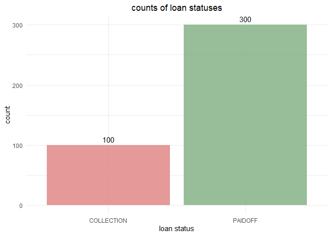
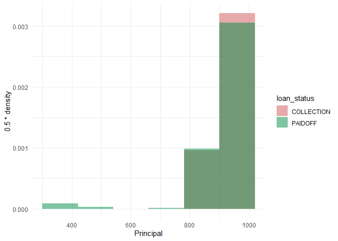
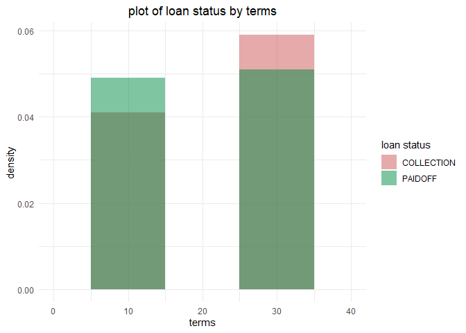
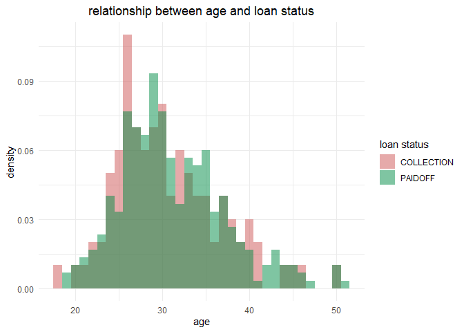
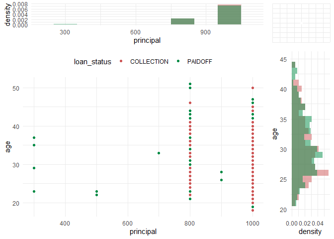
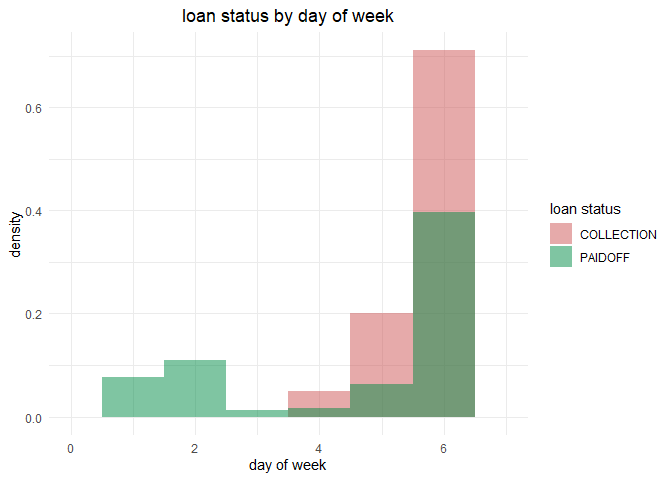
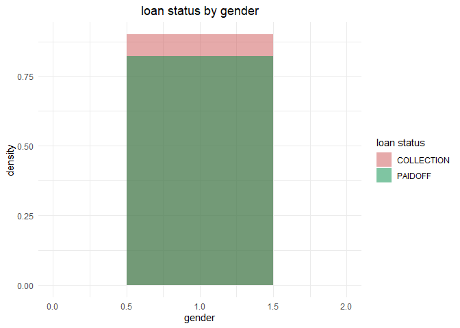

linear regression
================
chad allison
2023-01-23

### setup

``` r
library(tidyverse)
library(class)
library(VGAM)
library(gridExtra)
theme_set(theme_minimal())
options(scipen = 999)
```

### data import

``` r
df = read_csv("loan_data.csv", col_types = cols())
head(df)
```

    ## # A tibble: 6 x 11
    ##    ...1 Unnam~1 loan_~2 Princ~3 terms effectiv~4 due_date     age educa~5 Gender
    ##   <dbl>   <dbl> <chr>     <dbl> <dbl> <date>     <date>     <dbl> <chr>   <chr> 
    ## 1     0       0 PAIDOFF    1000    30 2016-09-08 2016-10-07    45 High S~ male  
    ## 2     1       1 PAIDOFF    1000    30 2016-09-08 2016-10-07    50 Bechal~ female
    ## 3     2       2 PAIDOFF    1000    30 2016-09-08 2016-10-07    33 Bechal~ female
    ## 4     3       3 PAIDOFF    1000    15 2016-09-08 2016-09-22    27 college male  
    ## 5     4       4 PAIDOFF    1000    30 2016-09-09 2016-10-08    28 college female
    ## 6     5       5 PAIDOFF     300     7 2016-09-09 2016-09-15    35 Master~ male  
    ## # ... with 1 more variable: dayofweek <dbl>, and abbreviated variable names
    ## #   1: `Unnamed: 0`, 2: loan_status, 3: Principal, 4: effective_date,
    ## #   5: education

### visualizing `loan_status` observations

``` r
df |>
  count(loan_status) |>
  ggplot(aes(loan_status, n)) +
  geom_col(aes(fill = loan_status), alpha = 0.75) +
  geom_text(aes(label = n), vjust = -0.5) +
  scale_fill_manual(values = c("#DC7777", "#76A877")) +
  labs(x = "loan status", y = "count",
       title = "counts of loan statuses") +
  theme(plot.title = element_text(hjust = 0.5),
        legend.position = "none")
```

<!-- -->

### visualizing `Principal`

``` r
df |>
  ggplot(aes(Principal)) +
  geom_histogram(aes(fill = loan_status, y = 0.5 * ..density..),
                 binwidth = 120, alpha = 0.5, position = "identity") +
  scale_fill_manual(values = c("indianred3", "springgreen4"))
```

    ## Warning: The dot-dot notation (`..density..`) was deprecated in ggplot2 3.4.0.

    ## Warning: Please use `after_stat(density)` instead.

<!-- -->

``` r
  labs(x = "principal", y = "density", fill = "loan status",
       title = "histogram of principal by loan status") +
  theme(plot.title = element_text(hjust = 0.5))
```

    ## NULL

### visualizing `terms`

``` r
df |>
  ggplot(aes(terms)) +
  geom_histogram(aes(fill = loan_status, y = 1 * ..density..),
                 binwidth = 10, alpha = 0.5, position = "identity") +
  scale_fill_manual(values = c("indianred3", "springgreen4")) +
  scale_x_continuous(limits = c(0, 40)) +
  labs(x = "terms", y = "density", fill = "loan status",
       title = "plot of loan status by terms") +
  theme(plot.title = element_text(hjust = 0.5))
```

<!-- -->

### visualizing `age`

``` r
df |>
  ggplot(aes(age)) +
  geom_histogram(aes(fill = loan_status, y = 1 * ..density..),
                 binwidth = 1, alpha = 0.5, position = "identity") +
  scale_fill_manual(values = c("indianred3", "springgreen4")) +
  labs(y = "density", fill = "loan status",
       title = "relationship between age and loan status") +
  theme(plot.title = element_text(hjust = 0.5))
```

<!-- -->

### visualizing multiple variables

``` r
hist_top = df |>
  ggplot(aes(Principal)) +
  geom_histogram(aes(fill = loan_status, y = 1 * ..density..),
                  binwidth = 100, alpha = 0.5, position = "identity") +
  scale_fill_manual(values = c("indianred3", "springgreen4")) +
  scale_x_continuous(limits = c(200, 1100)) +
  labs(x = "principal", y = "density") +
  theme(legend.position = "none")

empty = ggplot() +
  geom_point(aes(1, 1), col = "white") +
  theme(axis.ticks = element_blank(), 
        panel.background = element_blank(),
        axis.text.x = element_blank(),
        axis.text.y = element_blank(),
        axis.title.x = element_blank(),
        axis.title.y = element_blank())

scatter = df |>
  ggplot(aes(Principal, age)) +
  geom_point(aes(col = loan_status, fill = loan_status)) +
  scale_color_manual(values = c("indianred3", "springgreen4")) +
  theme(legend.position = "top") +
  labs(x = "principal", y = "age")

hist_right = df |>
  ggplot(aes(age)) +
  geom_histogram(aes(fill = loan_status, y = 0.5 * ..density..),
                 binwidth = 1, alpha = 0.5, position = "identity") +
  scale_x_continuous(limits = c(20, 45)) +
  scale_fill_manual(values = c("indianred3", "springgreen4")) +
  coord_flip() +
  theme(legend.position = "none") +
  labs(x = "age", y = "density")


grid.arrange(hist_top, empty, scatter, hist_right,
             ncol = 2, nrow = 2, widths = c(4, 1), heights = c(1, 4))
```

<!-- -->

### visualizing the day of week

``` r
df |>
  ggplot(aes(dayofweek)) +
  geom_histogram(aes(fill = loan_status, y = 1 * ..density..),
                 binwidth = 1, alpha = 0.5, position = "identity") +
  scale_x_continuous(limits = c(0, 7)) +
  scale_fill_manual(values = c("indianred3", "springgreen4")) +
  labs(x = "day of week", y = "density", fill = "loan status",
       title = "loan status by day of week") +
  theme(plot.title = element_text(hjust = 0.5))
```

<!-- -->

### converting days of week to categorical variable

``` r
namevector = c("Weekend")
df[, namevector] = 0
df$Weekend[df$dayofweek > 3] = 1
head(select(df, dayofweek, Weekend))
```

    ## # A tibble: 6 x 2
    ##   dayofweek Weekend
    ##       <dbl>   <dbl>
    ## 1         3       0
    ## 2         3       0
    ## 3         3       0
    ## 4         3       0
    ## 5         4       1
    ## 6         4       1

### encoding `Gender`

``` r
namevector = c("Gender01")
df[, namevector] = 0
df$Gender01[df$Gender == "male"] = 1
head(select(df, Gender, Gender01))
```

    ## # A tibble: 6 x 2
    ##   Gender Gender01
    ##   <chr>     <dbl>
    ## 1 male          1
    ## 2 female        0
    ## 3 female        0
    ## 4 male          1
    ## 5 female        0
    ## 6 male          1

### table of gender and loan status

``` r
table(df$Gender01, df$loan_status)
```

    ##    
    ##     COLLECTION PAIDOFF
    ##   0         10      53
    ##   1         90     247

### visualizing relationship between gender and loan status

``` r
df |>
  ggplot(aes(Gender01)) +
  geom_histogram(aes(fill = loan_status, y = 1 * ..density..),
                 binwidth = 1, alpha = 0.5, position = "identity") +
  scale_x_continuous(limits = c(0, 2)) +
  scale_fill_manual(values = c("indianred3", "springgreen4")) +
  labs(x = "gender", y = "density", fill = "loan status",
       title = "loan status by gender") +
  theme(plot.title = element_text(hjust = 0.5))
```

<!-- -->

### one hot encoding education

``` r
df = df |>
  mutate(educationBechalor = ifelse(education == "Bechalor", 1, 0),
         educationcollege = ifelse(education == "college", 1, 0),
         `educationHigh School or Below` = ifelse(education == "High School or Below", 1, 0),
         `educationMaster or Above` = ifelse(education == "Master or Above", 1, 0))

df |>
  select(14:17) |>
  head()
```

    ## # A tibble: 6 x 4
    ##   educationBechalor educationcollege `educationHigh School or Below` education~1
    ##               <dbl>            <dbl>                           <dbl>       <dbl>
    ## 1                 0                0                               1           0
    ## 2                 1                0                               0           0
    ## 3                 1                0                               0           0
    ## 4                 0                1                               0           0
    ## 5                 0                1                               0           0
    ## 6                 0                0                               0           1
    ## # ... with abbreviated variable name 1: `educationMaster or Above`

### getting data in data frame

``` r
Columns = c("Principal", "terms", "age", "educationBechalor", "educationcollege",
            "educationHigh School or Below", "educationMaster or Above", "Weekend", "Gender01")

Data = df[Columns]
head(Data)
```

    ## # A tibble: 6 x 9
    ##   Principal terms   age educationBecha~1 educa~2 educa~3 educa~4 Weekend Gende~5
    ##       <dbl> <dbl> <dbl>            <dbl>   <dbl>   <dbl>   <dbl>   <dbl>   <dbl>
    ## 1      1000    30    45                0       0       1       0       0       1
    ## 2      1000    30    50                1       0       0       0       0       0
    ## 3      1000    30    33                1       0       0       0       0       0
    ## 4      1000    15    27                0       1       0       0       0       1
    ## 5      1000    30    28                0       1       0       0       1       0
    ## 6       300     7    35                0       0       0       1       1       1
    ## # ... with abbreviated variable names 1: educationBechalor,
    ## #   2: educationcollege, 3: `educationHigh School or Below`,
    ## #   4: `educationMaster or Above`, 5: Gender01

### adding labels

``` r
NewColumn = c("Class")
Data[, NewColumn] = 0
Data$Class[df$loan_status == "PAIDOFF"] = 1
sample_n(select(Data, Class), 10)
```

    ## # A tibble: 10 x 1
    ##    Class
    ##    <dbl>
    ##  1     1
    ##  2     1
    ##  3     0
    ##  4     1
    ##  5     0
    ##  6     0
    ##  7     1
    ##  8     1
    ##  9     1
    ## 10     0

### normalize data

``` r
Data[Columns] = scale(Data[Columns])
head(Data[Columns])
```

    ## # A tibble: 6 x 9
    ##   Principal  terms    age educationBec~1 educa~2 educa~3 educa~4 Weekend Gende~5
    ##       <dbl>  <dbl>  <dbl>          <dbl>   <dbl>   <dbl>   <dbl>   <dbl>   <dbl>
    ## 1     0.501  0.920  2.31          -0.386  -0.867   1.15   -0.100  -1.22    0.432
    ## 2     0.501  0.920  3.14           2.58   -0.867  -0.867  -0.100  -1.22   -2.31 
    ## 3     0.501  0.920  0.322          2.58   -0.867  -0.867  -0.100  -1.22   -2.31 
    ## 4     0.501 -0.932 -0.673         -0.386   1.15   -0.867  -0.100  -1.22    0.432
    ## 5     0.501  0.920 -0.507         -0.386   1.15   -0.867  -0.100   0.820  -2.31 
    ## 6    -5.32  -1.92   0.653         -0.386  -0.867  -0.867   9.94    0.820   0.432
    ## # ... with abbreviated variable names 1: educationBechalor,
    ## #   2: educationcollege, 3: `educationHigh School or Below`,
    ## #   4: `educationMaster or Above`, 5: Gender01

### train test split

``` r
set.seed(123)
testindex = sample.int(nrow(Data))[1:floor(0.1 * nrow(Data))]
TestData = Data[testindex, ]
TrainData = Data[-testindex, ]
paste0(nrow(TrainData), " observations in training data; ",
       nrow(TestData), " observations in testing data")
```

    ## [1] "360 observations in training data; 40 observations in testing data"

### building model

``` r
model = glm(Class ~ ., family = binomial(link = "logit"), data = TrainData, control = list(maxit = 50))
summary(model)
```

    ## 
    ## Call:
    ## glm(formula = Class ~ ., family = binomial(link = "logit"), data = TrainData, 
    ##     control = list(maxit = 50))
    ## 
    ## Deviance Residuals: 
    ##     Min       1Q   Median       3Q      Max  
    ## -3.0215   0.1146   0.2069   0.8682   1.3942  
    ## 
    ## Coefficients: (1 not defined because of singularities)
    ##                                  Estimate Std. Error z value         Pr(>|z|)
    ## (Intercept)                      1.866040   0.252606   7.387 0.00000000000015
    ## Principal                        0.002954   0.185538   0.016            0.987
    ## terms                           -0.205533   0.173215  -1.187            0.235
    ## age                              0.184294   0.144469   1.276            0.202
    ## educationBechalor                0.196846   0.453072   0.434            0.664
    ## educationcollege                 0.238009   0.647735   0.367            0.713
    ## `educationHigh School or Below` -0.061044   0.645425  -0.095            0.925
    ## `educationMaster or Above`             NA         NA      NA               NA
    ## Weekend                         -1.714294   0.296261  -5.786 0.00000000718974
    ## Gender01                        -0.183637   0.157289  -1.168            0.243
    ##                                    
    ## (Intercept)                     ***
    ## Principal                          
    ## terms                              
    ## age                                
    ## educationBechalor                  
    ## educationcollege                   
    ## `educationHigh School or Below`    
    ## `educationMaster or Above`         
    ## Weekend                         ***
    ## Gender01                           
    ## ---
    ## Signif. codes:  0 '***' 0.001 '**' 0.01 '*' 0.05 '.' 0.1 ' ' 1
    ## 
    ## (Dispersion parameter for binomial family taken to be 1)
    ## 
    ##     Null deviance: 398.16  on 359  degrees of freedom
    ## Residual deviance: 303.18  on 351  degrees of freedom
    ## AIC: 321.18
    ## 
    ## Number of Fisher Scoring iterations: 6

### making predictions

``` r
fitted.results = predict(model, newdata = TestData, type = "response")
yhat = ifelse(fitted.results > 0.5, 1, 0)
yhat[1:5]
```

    ## 1 2 3 4 5 
    ## 1 1 1 1 0

### getting labels

``` r
y = TestData[, c("Class")]
y[1:4, ]
```

    ## # A tibble: 4 x 1
    ##   Class
    ##   <dbl>
    ## 1     1
    ## 2     1
    ## 3     1
    ## 4     0

### getting accuracy

``` r
mean(yhat == y)
```

    ## [1] 0.6
