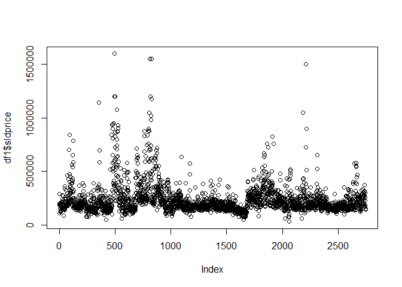
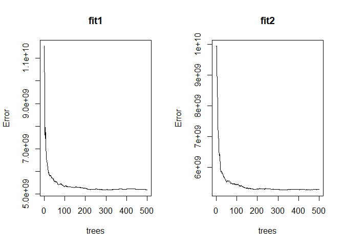

random forest exercise
================
chad allison \| 20 january 2023

### setup

``` r
library(randomForest)
```

### importing data

``` r
df1 = read.csv("https://ibm.box.com/shared/static/fzceg5vdj9hxpf7aopgvfgobi1g4vb4v.csv")
head(df1)
```

    ##   sldprice rooms beds    d_cbd hway_1 sway_1 hh_avinc detach brick air_con
    ## 1   287000     7    3 13.81330      0      0    47370      1     1       1
    ## 2   200000     6    3 14.91826      1      0    50386      1     1       1
    ## 3   199900     7    2 14.56703      0      0    50386      1     0       1
    ## 4   182500     6    3 14.62712      0      0    50386      1     1       0
    ## 5   110500     4    2 14.69022      0      0    50386      1     0       0
    ## 6   156000     4    2 14.50963      1      0    50386      1     1       1
    ##   bsmt_fin
    ## 1        1
    ## 2        0
    ## 3        1
    ## 4        1
    ## 5        0
    ## 6        1

### plotting data

``` r
plot(df1$sldprice)
```

<!-- -->

### removing NA values

``` r
df2 = na.omit(df1)
head(df2)
```

    ##   sldprice rooms beds    d_cbd hway_1 sway_1 hh_avinc detach brick air_con
    ## 1   287000     7    3 13.81330      0      0    47370      1     1       1
    ## 2   200000     6    3 14.91826      1      0    50386      1     1       1
    ## 3   199900     7    2 14.56703      0      0    50386      1     0       1
    ## 4   182500     6    3 14.62712      0      0    50386      1     1       0
    ## 5   110500     4    2 14.69022      0      0    50386      1     0       0
    ## 6   156000     4    2 14.50963      1      0    50386      1     1       1
    ##   bsmt_fin
    ## 1        1
    ## 2        0
    ## 3        1
    ## 4        1
    ## 5        0
    ## 6        1

### creating model

``` r
fit1 = randomForest(sldprice ~ ., data = df2, importance = T)
print(fit1)
```

    ## 
    ## Call:
    ##  randomForest(formula = sldprice ~ ., data = df2, importance = T) 
    ##                Type of random forest: regression
    ##                      Number of trees: 500
    ## No. of variables tried at each split: 3
    ## 
    ##           Mean of squared residuals: 5197165590
    ##                     % Var explained: 73.22

### variable importance

``` r
round(importance(fit1, type = 1), 2)
```

    ##          %IncMSE
    ## rooms      51.63
    ## beds       27.77
    ## d_cbd      55.61
    ## hway_1      5.54
    ## sway_1     19.15
    ## hh_avinc   63.44
    ## detach     22.17
    ## brick      13.69
    ## air_con    25.22
    ## bsmt_fin   16.98

### re-fitting the model

``` r
fit2 = randomForest(sldprice ~ ., data = df2, proximity = T, importance = T, action = na.omit)
print(fit2)
```

    ## 
    ## Call:
    ##  randomForest(formula = sldprice ~ ., data = df2, proximity = T,      importance = T, action = na.omit) 
    ##                Type of random forest: regression
    ##                      Number of trees: 500
    ## No. of variables tried at each split: 3
    ## 
    ##           Mean of squared residuals: 5279859464
    ##                     % Var explained: 72.79

### new model variable importance

``` r
round(importance(fit2, type = 1), 2)
```

    ##          %IncMSE
    ## rooms      51.22
    ## beds       28.24
    ## d_cbd      57.23
    ## hway_1      3.47
    ## sway_1     19.39
    ## hh_avinc   60.24
    ## detach     22.94
    ## brick      14.71
    ## air_con    26.12
    ## bsmt_fin   15.33

### plotting models

``` r
par(mfrow = c(1, 2))
plot(fit1)
plot(fit2)
```

<!-- -->
